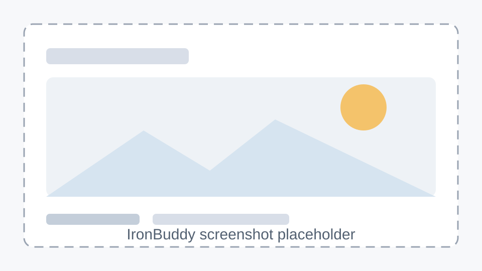

# 01 快速上手

本章给出从打开页面到完成一次演示的最短路径。它面向现场操作者，默认板端
和本机已经在同一网络内，真实 IP 由当天网络环境决定。

## 前置检查

开始前先确认浏览器、板端服务和网络都可达。不要在手册、截图或提交记录中
写入真实密钥值。

- 已知道板端地址：`<BOARD_IP>`
- 已能访问主页面：`http://<BOARD_IP>:5000/`
- 已能访问数据库页：`http://<BOARD_IP>:5000/database`
- 如果使用 SensorLab，本机已能启动 `tools/ironbuddy_sensor_lab.py`
- 如果使用飞书或语音云服务，配置文件只在本地或板端保存

## 五步上手

以下步骤用于一次最小闭环演示。真实训练前，先用 mock 或短流程确认 UI
不会卡在加载状态。

1. 打开主页面：访问 `http://<BOARD_IP>:5000/`。
2. 检查服务状态：确认视频、FSM、EMG、语音和 LLM 区域显示正常。
3. 采纳训练计划：在智能规划区域生成或接受当天计划。
4. 完成一组动作：观察次数、合格率和疲劳值是否更新。
5. 查看总结与记录：等待训练总结弹窗，再打开数据库页核对训练记录。

## 常用入口

现场可以把这三个地址放在浏览器书签栏，便于快速切换。

| 页面 | 地址 | 用途 |
| --- | --- | --- |
| 主页面 | `http://<BOARD_IP>:5000/` | 展示视频、训练计划、对话和训练状态 |
| 数据库 | `http://<BOARD_IP>:5000/database` | 查看 session、rep、LLM 和每日汇总 |
| SensorLab | `http://127.0.0.1:8766/` | 本机采集、分析和模型训练调试 |

## 线上手册入口

主页面控制台里有 **使用手册** 链接，地址是
`https://qqyyqq812.github.io/IronBuddy/`。如果页面还没有更新，通常是
GitHub Pages 发布任务还没跑完；先使用本目录的本地版本即可。

## 异常处理

如果页面打不开，先区分是网络不可达、服务没启动，还是浏览器缓存问题。

- 主页面打不开：确认 `<BOARD_IP>` 是否变化，确认 `streamer_app.py` 正在运行。
- 页面能开但数据不动：检查 `/state_feed` 和 `/api/muscle_activation`。
- 数据库页为空：先完成一次训练或使用已有演示数据。
- 语音无响应：先使用手动输入或按钮完成演示闭环。

## 截图占位

以下截图位先使用本地占位图，后续替换为真实页面截图。

| 截图位 | 画面 | 占位 |
| --- | --- | --- |
| 01-1 | 主页面打开成功 |  |
| 01-2 | 服务状态正常 |  |
| 01-3 | 智能规划区域 |  |
| 01-4 | 一组训练完成 |  |
| 01-5 | 数据库记录可见 |  |

## 下一步

如果主流程能走通，继续阅读 [02 智能规划与训练总结](02_智能规划与训练总结.md)。
