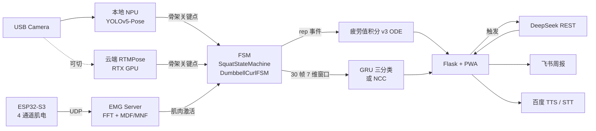

<div class="ironbuddy-hero" markdown>

## IronBuddy 智能健身教练系统

IronBuddy 是一个跑在边缘设备（Toybrick RK3399ProX）上的智能健身教练系统。它把**实时视觉骨架**、**表面肌电信号**、**有限状态机动作识别**、**GRU 三分类教练点评**、**LLM 训练规划**和**语音对话**串成一条闭环：用户做一组动作，系统就在板端实时识别、计数、判定是否标准，同时累积疲劳值并在训练间隙给出口语化的建议和点评。

系统设计的核心理念是**离线优先、云端可选**：所有判定逻辑、动作计数、疲劳积分都在板端完成，云端 GPU 仅在需要更高精度骨架时作为可选增强。即便完全断网，本地 NPU 视觉模型 + ESP32 肌电传感器仍能完成完整训练闭环。

</div>

## 系统能做什么

<div class="ib-card-grid" markdown>

<a class="ib-card" href="01_%E7%94%A8%E6%88%B7%E6%89%8B%E5%86%8C/">
  <div class="ib-card-title">📖 用户手册</div>
  <div class="ib-card-desc">系统全功能介绍：动作、模式、视觉后端、智能计划</div>
</a>

<a class="ib-card" href="02_%E6%99%BA%E8%83%BD%E8%A7%84%E5%88%92%E4%B8%8E%E8%AE%AD%E7%BB%83%E6%80%BB%E7%BB%93/">
  <div class="ib-card-title">🧭 智能规划与训练总结</div>
  <div class="ib-card-desc">DeepSeek 生成计划、组间总结、训练报告</div>
</a>

<a class="ib-card" href="03_%E6%95%B0%E6%8D%AE%E5%BA%93%E4%B8%8E%E8%AE%AD%E7%BB%83%E8%B6%8B%E5%8A%BF/">
  <div class="ib-card-title">🗂️ 数据库页</div>
  <div class="ib-card-desc">训练记录、跨日趋势、rep 级回放</div>
</a>

<a class="ib-card" href="04_%E8%AF%AD%E9%9F%B3%E6%8E%A7%E5%88%B6%E4%B8%8E%E9%A3%9E%E4%B9%A6%E5%91%A8%E6%8A%A5/">
  <div class="ib-card-title">🗣️ 语音控制与飞书周报</div>
  <div class="ib-card-desc">完整语音命令列表、两段式唤醒、模糊匹配</div>
</a>

<a class="ib-card" href="05_%E8%B0%83%E8%AF%95%E5%8F%B0%E4%B8%8ESensorLab/">
  <div class="ib-card-title">🛠 调试台与 SensorLab</div>
  <div class="ib-card-desc">EMG 采集面板、模型训练、骨架回放</div>
</a>

<a class="ib-card" href="06_%E7%A1%AC%E4%BB%B6%E9%83%A8%E7%BD%B2/">
  <div class="ib-card-title">📦 硬件部署</div>
  <div class="ib-card-desc">板端服务、云端 GPU 隧道、ESP32 对码</div>
</a>

</div>

## 设计理念

IronBuddy 把"AI 健身教练"这件事拆成三层独立的判定：

- **几何层（FSM）**：从骨架关键点计算膝关节或肘关节角度，按角度阈值判断 rep 是否完成。这一层最稳定，是计数和"达标 / 不达标"的最终来源。
- **质量层（GRU 三分类）**：在视觉+传感模式下，把单次动作的 30 帧 × 7 维特征送入轻量 GRU 模型，给出"标准 / 代偿 / 错误"分类。这一层提供动作质量评价。
- **决策层（LLM）**：DeepSeek 根据训练计划、当前 rep 数和疲劳积分，决定何时弹组间总结、何时建议休息、何时把训练战报推送到飞书。

这三层之间通过共享内存解耦：视觉进程产出骨架、FSM 进程消费骨架产出 rep 事件、教练进程消费 rep 事件产出口语化回复。任意一层故障都可独立降级。

## 主要访问入口

| 页面 | 默认地址 | 用途 |
|------|----------|------|
| **主页面** | `http://<BOARD_IP>:5000/` | 训练实时控制台、视频、计划、对话 |
| 数据库 | `http://<BOARD_IP>:5000/database` | 8 张表、趋势、rep 回放 |
| 管理页 | `http://<BOARD_IP>:5000/admin` | 服务管控 |
| SensorLab | `http://127.0.0.1:8766/` | 本地调试采集面板 |
| 本手册 | `https://qqyyqq812.github.io/IronBuddy/` | GitHub Pages 在线版 |

## 架构概览



## 文档生成

本手册用 [MkDocs Material](https://squidfunk.github.io/mkdocs-material/) 构建，每次推送到 GitHub 主分支后自动重新部署到 GitHub Pages。

本地预览：

```bash
pip install mkdocs mkdocs-material pymdown-extensions
mkdocs serve  # 本机 http://127.0.0.1:8000
```
