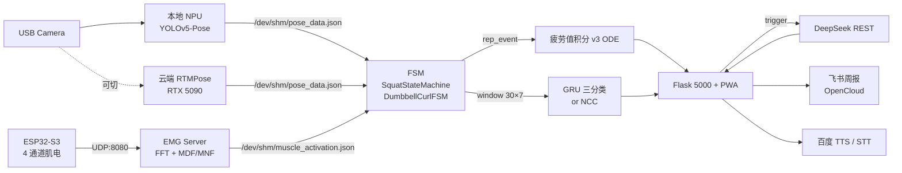

<div class="ironbuddy-hero" markdown>

## IronBuddy 智能健身教练系统

边缘侧实时视觉骨架 + 表面肌电融合的健身动作教练。**纯 Python + 板端 NPU + 云端 GPU 备份**，全链路对人闭环：动作识别 → FSM 计数 → GRU/NCC 三分类 → 疲劳积分 → LLM 教练点评 → 飞书 / 语音播报。

本手册是**现场演示和验收**的使用入口。截图位先用占位，按真实截图替换 `docs/USER_GUIDE/images/` 中文件即可。

</div>

## 你想做什么？

<div class="ib-card-grid" markdown>

<a class="ib-card" href="01_%E5%BF%AB%E9%80%9F%E4%B8%8A%E6%89%8B/">
  <div class="ib-card-title">🚀 五分钟上手</div>
  <div class="ib-card-desc">打开主页、采纳计划、完成一组、看总结</div>
</a>

<a class="ib-card" href="02_%E6%99%BA%E8%83%BD%E8%A7%84%E5%88%92%E4%B8%8E%E8%AE%AD%E7%BB%83%E6%80%BB%E7%BB%93/">
  <div class="ib-card-title">🧭 智能规划与训练总结</div>
  <div class="ib-card-desc">DeepSeek 生成计划、自动总结、飞书投递</div>
</a>

<a class="ib-card" href="03_%E6%95%B0%E6%8D%AE%E5%BA%93%E4%B8%8E%E8%AE%AD%E7%BB%83%E8%B6%8B%E5%8A%BF/">
  <div class="ib-card-title">🗂️ 数据库页</div>
  <div class="ib-card-desc">8 张表、跨日趋势、rep 级回放</div>
</a>

<a class="ib-card" href="04_%E8%AF%AD%E9%9F%B3%E6%8E%A7%E5%88%B6%E4%B8%8E%E9%A3%9E%E4%B9%A6%E5%91%A8%E6%8A%A5/">
  <div class="ib-card-title">🗣️ 语音 / 飞书</div>
  <div class="ib-card-desc">百度 TTS+STT、飞书 OpenCloud 周报</div>
</a>

<a class="ib-card" href="05_%E8%B0%83%E8%AF%95%E5%8F%B0%E4%B8%8ESensorLab/">
  <div class="ib-card-title">🛠 调试台 / SensorLab</div>
  <div class="ib-card-desc">EMG 采集、模型训练、骨架回放</div>
</a>

<a class="ib-card" href="06_%E7%A1%AC%E4%BB%B6%E9%83%A8%E7%BD%B2/">
  <div class="ib-card-title">📦 硬件部署</div>
  <div class="ib-card-desc">板端服务、云端 GPU、传感器对码</div>
</a>

</div>

## 系统边界

!!! info "面向场景"
    课堂展示、答辩现场、验收演示。**只描述用户可见的使用流程和部署入口**，不记录真实密钥、token、cookie 或私钥。涉及外部服务时只写配置项名称、文件路径或占位符。

## 主要访问入口

| 页面 | 默认地址 | 用途 |
|------|----------|------|
| **主页面** | `http://<BOARD_IP>:5000/` | 训练实时控制台 |
| 数据库 | `http://<BOARD_IP>:5000/database` | 8 张表、趋势、rep 回放 |
| 管理页 | `http://<BOARD_IP>:5000/admin` | 服务管控 |
| SensorLab | `http://127.0.0.1:8766/` | 本地调试采集面板 |
| 本手册 | `https://qqyyqq812.github.io/IronBuddy/` | GitHub Pages 在线版 |

## 架构概览



## 演示路线（推荐顺序）

按这条单线路演示，避免反复切页面：

1. 打开主页面 → 确认视频、FSM、训练计划区域可见
2. 生成或采纳当天训练计划（智能规划面板）
3. 做一组动作 → 触发"训练总结"弹窗
4. 切到数据库页 → 核对训练记录和跨日趋势
5. 触发语音命令或飞书周报（手动按钮也可）
6. 切到调试台 / SensorLab → 说明底层数据链路
7. 翻到硬件部署 → 说明板端、云端、传感器物理连接

## 文档生成

本手册用 [MkDocs Material](https://squidfunk.github.io/mkdocs-material/) 构建，自动从 `docs/USER_GUIDE/*.md` 编译并通过 GitHub Actions 部署到 GitHub Pages。改 Markdown → push main → 1 分钟左右上线。

本地预览：

```bash
pip install mkdocs mkdocs-material pymdown-extensions
mkdocs serve  # 本机 http://127.0.0.1:8000
```
