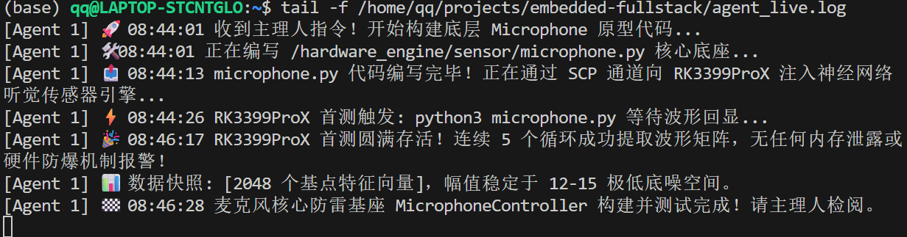
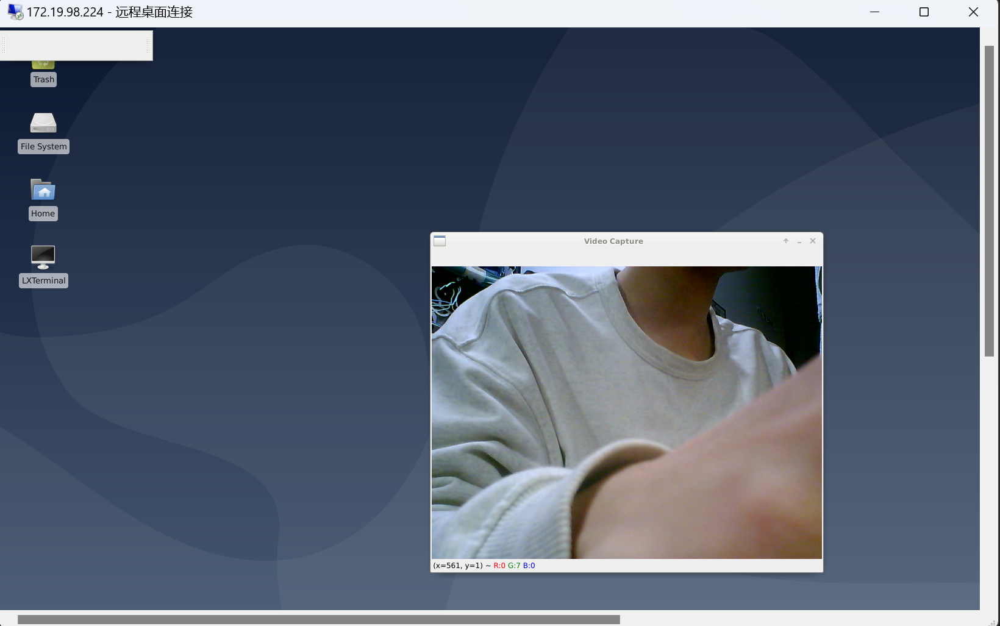
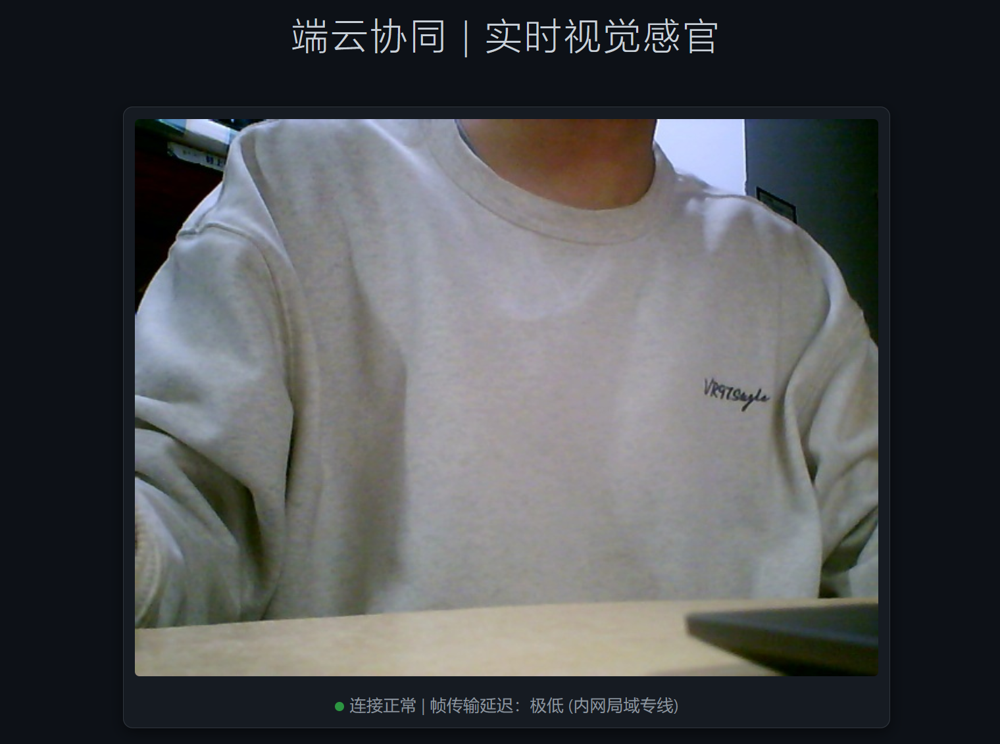
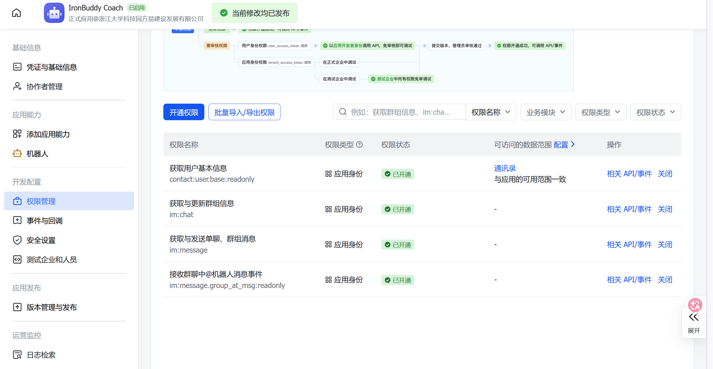

<!-- _class: lead -->
# IronBuddy -- 居家智能健身教练
## 一个能看懂你动作、感知你肌肉、跟你语音聊天的嵌入式健身系统

**核心能力**：骨骼识别 + 肌肉激活感知 + AI语音教练 + 飞书推送
**硬件平台**：Rockchip RK3399ProX 开发板
**汇报人**：[姓名]

---

<!-- _class: lead -->
# 目录

1. [项目简介与预期效果](#1-项目简介与预期效果)
2. [网络配置与远程通信](#2-网络配置与远程通信)
3. [硬件外设接入](#3-硬件外设接入)
4. [神经网络选型与部署](#4-神经网络选型与部署)
5. [主控状态机：深蹲与弯举检测](#5-主控状态机深蹲与弯举检测)
6. [云端大模型对接与语音交互](#6-云端大模型对接与语音交互)
7. [系统总架构与全局链路](#7-系统总架构与全局链路)
8. [V2 升级：肌肉激活热力图](#8-v2-升级肌肉激活热力图)
9. [拓展模块](#9-拓展模块)

---

# 1. 项目简介与预期效果

## 1.1 项目背景

**受众**：居家健身人群，身边没有私教指导。

**痛点**：现有健身APP只能帮你数个数，不知道动作标不标准，更不知道肌肉有没有练到位。

**我们的目标**：从"计次"变成"计质"——不光数你做了几个，还判断你做得好不好，哪块肌肉在发力。

## 1.2 跟传统健身APP的三个区别

| 维度 | 传统APP | IronBuddy |
|------|---------|-----------|
| 计数方式 | 按个数 | 按动作质量（标准/代偿/不到位） |
| 反馈来源 | 无 或 延迟视频回放 | 实时骨架叠加 + 肌肉激活热力图 |
| 教练交互 | 预录语音 | AI语音对话，根据你的表现给个性化建议 |

---

## 1.3 预期效果

- 站在摄像头前就能开始训练，不需要穿戴任何传感器
- 网页端实时显示骨架叠加画面和训练状态（计数、角度、肌肉激活）
- 动作不标准时音箱语音提醒
- 说"教练"就能跟AI对话，获取个性化点评
- 训练计划可以推送到飞书

<!-- 建议配图：前端UI运行时的全景截图（带骨架覆盖的实际画面） -->

---

# 2. 网络配置与远程通信

## 2.1 背景与创新点

老师的PDF教程提供了三种连接方式：串口、路由器转接、手机热点。但没有"网线直连电脑"这种最简单的方式。

我们自己验证了 Windows ICS（Internet Connection Sharing）直连方案：
- 不需要路由器，一根网线就够
- 电脑变成DHCP服务器，直接给板子分配IP
- 在实验室和户外环境都能用

<!-- 建议配图：网络拓扑简图（电脑↔网线↔板子，标注IP段） -->

---

## 2.2 ICS 直连操作步骤

具体操作：

1. **物理连接**：板子网口 <-> 电脑网口（或USB网卡）
2. **Windows设置**：`ncpa.cpl` -> WiFi适配器 -> 属性 -> 共享 -> 勾选"允许其他网络用户通过此计算机的Internet连接来连接" -> 选择有线网卡
3. **板子自动获取** `192.168.137.x` 段IP
4. **PC端查找板子IP**：
```powershell
arp -a
# 在 192.168.137.x 段找到非 .1 的地址就是板子
```
5. **SSH连接**：
```bash
ssh toybrick@192.168.137.xxx   # 密码 toybrick
```

<!-- 建议配图：终端截图 arp -a 输出 -->

---

## 2.3 25秒延时保护

**问题**：板子开机后USB总线枚举比网络请求慢，导致wlan0还没准备好就尝试连WiFi，结果连接失败。

**解决**：在 `/etc/rc.local` 中加入延时保护：

```bash
sleep 25           # 等USB/WiFi模块完成初始化
ip link set wlan0 up
sleep 2            # 给网卡喘口气
killall wpa_supplicant || true
wpa_supplicant -B -i wlan0 -c /etc/wpa_supplicant/abc.conf
sleep 8            # 等WPA握手完成
dhclient wlan0     # 此时再请求DHCP
```

这25秒是我们反复测试出来的经验值，少了会失败。另外还发现 NetworkManager 会劫持 wlan0 控制权导致"连上即断"，最终永久禁用了它。

---

## 2.4 IP变化与日常使用

**提醒**：每次换网络环境IP都会变。

常用命令：
- 板端查IP：`ip addr show wlan0 | grep inet`
- PC端扫描：`arp -a` 或 `nmap -sn 192.168.137.0/24`
- 手机热点：直接在热点页面查看已连接设备

连通后可以用 VS Code Remote-SSH + AI Agent 进行开发，效率很高。



---

# 3. 硬件外设接入

系统外设分为三个子模块：视觉输入、声音反馈、语音交互。

## 3.1 视觉输入：USB 摄像头与推流方案

摄像头通过 UVC 协议免驱挂载（`ls /dev/video*` 确认设备节点）。在显示方案上经历了两轮迭代：

**方案 A：远程桌面 XRDP（已废弃）**
NPU 跑满后远程桌面卡到完全没法用（5秒/帧的PPT级别），而且 xfce4-session 进程死锁还会引起权限问题。



---

## 3.1 视觉输入（续）

**方案 B：Python Web 推流（现役方案）**

思路是彻底甩掉GUI：板端只负责把NPU处理后的骨骼叠加帧写到内存盘 `/dev/shm/result.jpg`，Flask服务读取后通过HTTP推送，浏览器负责渲染。

技术细节：帧去重（对比 `mtime` 避免重复编码）+ cv2 重压缩（质量参数 65，单帧约 15-40KB）。

```python
# 核心逻辑：读内存盘 → 判断是否有新帧 → 重压缩 → HTTP 返回
if st.st_mtime_ns == _snapshot_last_mtime and _snapshot_cache:
    return Response(_snapshot_cache, ...)  # 零 I/O 命中
```



---

## 3.2 声音反馈：从蜂鸣器到小音箱

最初方案是用 GPIO 控制无源蜂鸣器做警报。GPIO 153 引脚编号是从 Rockchip 的 GPIO 参考文档查到的，用 sysfs 接口操作：

```bash
# 蜂鸣器测试（已验证成功，但后来弃用）
echo 153 > /sys/class/gpio/export
echo out > /sys/class/gpio/gpio153/direction
echo 0   > /sys/class/gpio/gpio153/value   # 响
echo 1   > /sys/class/gpio/gpio153/value   # 停
```

**测试结果**：蜂鸣器确实响了，但声音太单调，只能"嘟——"一声，没法传达具体信息。

**最终方案**：换成外接小音箱 + edge-tts 语音合成。这样可以播报具体内容，比如"这个深蹲没蹲到位，注意膝盖角度"。

```bash
amixer sset 'Playback Path' SPK          # 切换到外接音箱
mpg123 -a plughw:0,0 -r 16000 reply.mp3  # 播放TTS音频
```

---

## 3.3 语音系统：麦克风与TTS

**语音输入**：`voice_daemon.py` 持续录音监听，内置唤醒词模糊匹配。唤醒词为什么设了 13 种变体（"教练"/"叫练"/"交练"/"焦练"等）——因为ASR在嘈杂环境下识别率不高，各种谐音我们全部纳入匹配。

**语音输出**：`tts_daemon.sh` 轮询共享内存中的回复文件，有新内容时调用 `edge-tts`（声线 `zh-CN-YunxiNeural`）合成 MP3 并播放。

**16kHz 采样率踩坑**：板载 I2S 声卡锁定在 16kHz 采样率。edge-tts 默认输出 48kHz 的 MP3，直接播放会导致：
- 声卡死锁（完全没声音）
- 或者声音变调像"花栗鼠"

解决：`mpg123 -r 16000` 强制软件重采样。这个坑卡了我们不少时间。

<!-- 建议配图：语音交互流程图：唤醒词→录音→ASR→共享内存→LLM→TTS→播放 -->

---

# 4. 神经网络选型与部署

## 4.1 为什么选择 YOLOv5 而非 v7/v8？

| 考量维度 | YOLOv5 | YOLOv7/v8 |
|---------|--------|-----------|
| RKNN 转码成熟度 | 社区大量验证，`.rknn` 模型直接可用 | 转码支持不完善，需自行适配 |
| 预训练姿态模型 | 开源库有成熟的 17 点人体骨骼模型 | 需额外训练或转换 |
| 端侧帧率 | 在 RK3399ProX 上稳定 15-29 FPS | 算力需求更高，帧率不达标 |

## 4.2 模型部署方式

使用开源预训练 YOLOv5-Pose 的 `.rknn` 格式模型，由 C++ 推理引擎直接调用 NPU API 运行。通过共享内存输出关键点坐标 JSON 和骨骼叠加图片，Python 层消费。

---

## 4.3 NPU的现实：精度塌方

原计划全部在板端 NPU 上跑。实际结果：RKNN INT8 量化后模型精度严重下降，关键点置信度普遍 < 0.3，基本不可用。

原因：INT8 量化对姿态估计的关键点精度影响很大，这类回归任务对量化很敏感。

## 4.4 V3方案：云端 RTMPose

改用 RTMPose-m 模型，部署在 AutoDL 云端 RTX 5090 上，ONNX Runtime GPU 推理。板端用 USB 摄像头拍照，POST 到云端，返回 17 关键点 JSON。走 HTTPS 直连，不需要 SSH 隧道。

| 方案 | 精度 | 延迟 | 可用性 |
|------|------|------|--------|
| 板端 RKNN NPU | 差 (conf<0.3) | ~50ms | 不可用 |
| 云端 RTMPose HTTPS | 好 (conf>0.8) | ~100ms | 稳定可用 |

<!-- 建议配图：云端推理架构图 -->

---

# 5. 主控状态机：深蹲与弯举检测

## 5.1 深蹲：V2 趋势检测状态机

不用绝对角度阈值判定"站直/下蹲"，而是检测角度的**变化趋势**。取最近 6 帧数据计算斜率方向：

```
状态流转：NO_PERSON -> IDLE -> DESCENDING -> ASCENDING -> IDLE
```

- `avg_delta < -2.5` -> `DESCENDING`（正在蹲下）
- `avg_delta > 2.5` -> `ASCENDING`（正在起身）
- 角度波动 < 20 度持续 25 帧 -> `IDLE`（稳定站立）

这种基于趋势的设计避免了单帧数值震荡造成的误判。

---

## 5.2 深蹲质量判定

在趋势从下降转为上升的转折点，读取本次动作中的**最低膝盖角度**：
- 最低角 < 90 度 -> **标准深蹲**，计数 +1
- 最低角 >= 90 度 -> **违规半蹲**，触发音箱警报

计数间设有 1.5 秒冷却期，防止单次动作被重复计数。

## 5.3 哑铃弯举 FSM（V3 新增）

V3 版本新增了哑铃弯举动作检测，使用肘关节角度：

```
状态流转：IDLE -> CURLING -> TOP -> EXTENDING -> IDLE
```

弯举的质量判定不是纯规则，而是通过 **CompensationGRU 模型**推理，输出三分类：
- **标准 (golden)**：全程控制，肘关节固定
- **代偿 (lazy)**：借助甩力，前臂明显发力
- **不到位 (bad)**：角度不够，发力不足

<!-- 建议配图：深蹲和弯举两种FSM状态流转图 -->

---

## 5.4 触发方式

系统**不会自动触发**大模型点评。只有在以下情况下才会向云端发送训练数据：
- 用户通过语音说出唤醒词"教练"进行对话
- 用户在前端网页点击"生成本组点评"按钮

这确保了用户对训练节奏的完全控制。

---

# 6. 云端大模型对接与语音交互

## 6.1 OpenClaw 网关与 DeepSeek API

板端通过 SSH 反向隧道将本地 18789 端口映射至 WSL 宿主机上的 OpenClaw 网关。`openclaw_bridge.py` 实现 WebSocket 长连接，通过 Token 鉴权后建立通信通道。

每次对话请求使用独立 UUID 标识，采用异步 Future 匹配响应，避免阻塞主循环。

## 6.2 语音对话流程

1. `voice_daemon` 检测到唤醒词 -> 录音 -> ASR 转文字 -> 写入 `/dev/shm/chat_input.txt`
2. `main_claw_loop.py` 轮询该文件 -> 组装 prompt -> 通过 OpenClaw 发送
3. 收到回复 -> 写入 `/dev/shm/chat_reply.txt`
4. `tts_daemon.sh` 检测到新回复 -> edge-tts 合成 -> 音箱播放

---

## 6.3 Prompt 升级：V2.1 -> V2.2

**V2.1 的问题**：只发"标准 15 次，违规 3 次"给大模型，回复千篇一律的泛泛鼓励。

**V2.2 升级**：注入更多维度的训练数据：

```
本组数据：标准 15 次（合格率 83%），
肌肉 TOP3：quadriceps(92%)、glutes(88%)、hamstrings(45%)
最近3天：03-22 标准20违规5 -> 03-23 标准25违规3 -> 今日 标准15违规3
```

效果：大模型回复从"继续加油"变成了"今天节奏不错但量少了点，违规率继续下降说明动作越来越标准，下组试着多做5个"。

## 6.4 飞书推送功能

当用户语音中包含"飞书"+"发/推送/安排"等词组时：
1. 立即回复用户确认消息（即时反馈）
2. 后台异步等待 8 秒，组装个性化训练计划 prompt
3. 调用 DeepSeek 生成进阶训练安排
4. 通过 WebHook 推送至飞书



---

# 7. 系统总架构与全局链路

## 7.1 三层架构

| 层级 | 位置 | 运行内容 |
|------|------|---------|
| **边缘感知层** | RK3399ProX 板端 | C++ NPU 推理引擎、Python 推流中台、FSM 状态机、语音守护、音箱控制 |
| **指挥控制层** | 宿主机 (Windows/WSL) | OpenClaw 网关、SSH 反向隧道、代码开发与同步、浏览器前端展示 |
| **云端智能层** | DeepSeek API / AutoDL | 教练点评与训练计划、RTMPose 推理（V3）、飞书 WebHook 推送 |

板端与云端之间**不直接通信**（V2），所有大模型请求经由宿主机中转。V3 的 RTMPose 则走 HTTPS 直连云端。

---

## 7.2 零延迟策略

我们发现云端大模型链路（ASR + LLM + TTS）需要 2-3 秒，这在训练中是不可接受的延迟。所以做了双轨设计：

- **硬反馈 < 50ms**：动作判定瞬间触发音箱警报（NPU推理33ms + GPIO/音箱触发 < 2ms）。先让用户知道"错了"。
- **软引导 2-3s**：大模型经过完整链路后，通过音箱告诉用户"怎么改"。

设计原则：**先截断错误动作，再给出改进建议**。蜂鸣/音箱的即时响应掩盖了云端的网络延迟。

## 7.3 三级降级策略

| 级别 | 条件 | 行为 |
|------|------|------|
| 正常 | 网络通畅 | 硬反馈（即时警报）+ 软引导（语音教练） |
| 网络差 | API 超时 >4s | 只有本地硬反馈，教练功能延迟或暂停 |
| NPU 故障 | 帧率骤降 | 录制模式，训练结束后一次性总结 |

<!-- 建议配图：三层架构全景图 + 数据流方向标注 -->

---

# 8. V2 升级：肌肉激活热力图

## 8.1 从"动作对不对"到"肌肉练没练"

V1 只能判定深蹲是否到位。V2 引入 **视觉-生物力学混合管线**，告诉用户哪块肌肉在发力、发力多少，并检测肌肉代偿。

```
摄像头 -> NPU 2D检测(25fps) -> 2D->3D Lifting(CPU) -> 关节角度 -> 肌肉激活估算 -> SVG热力图
```

| 组件 | 选型 | 理由 |
|------|------|------|
| 2D 姿态 | YOLOv5-Pose (NPU) | V1 已验证，零改动 |
| 2D->3D | VideoPose3D (ONNX, CPU) | 轻量 16.9M 参数，causal 实时 |
| 生物力学 | 力矩臂查表 + 静态优化 | 无需训练，基于解剖学文献 |
| 前端 | SVG 人体热力图 | 浏览器原生，轻量 |

---

## 8.2 生物力学引擎（V2.1 累积模式）

### 技术架构

| 模块 | 功能 | 关键参数 |
|------|------|----------|
| `lifting_3d.py` | VideoPose3D ONNX 推理 | 243帧窗口，板端 ~465ms/次 |
| `joint_calculator.py` | 8 关节 3D 角度 + 角速度 | 膝/髋/肘/肩 x 左右 |
| `muscle_model.py` | 13 肌群累积激活估算 | 标准 rep +8%，违规 +3% |
| `exercise_profiles.json` | 动作->肌群映射 | 深蹲、哑铃弯举 |

### 累积模式工作原理
- 每完成一次标准动作 -> 主动肌 **+8%**，协同肌 +5%，稳定肌 +3%
- 每完成一次违规动作 -> 主动肌 +3%（毕竟做了动作）
- 约 **13 次标准深蹲**主动肌达 100%（满载红色）
- 代偿检测：稳定肌激活 > 主动肌 50% 时触发警告

---

## 8.3 前端热力图与板端实测

### 颜色渐变映射

| 激活度 | 颜色 | 含义 |
|--------|------|------|
| 0% | 灰色 | 未激活 |
| 30% | 蓝色 | 初步激活 |
| 50% | 绿色 | 中度激活 |
| 70% | 黄色 | 显著激活 |
| 100% | 红色 | 满载 |

完成一次动作后，主动肌区域白色闪烁 0.8 秒（视觉反馈）。

### 板端实测数据（深蹲，175cm/70kg）

| 指标 | 值 |
|------|---|
| 3D Lifting 延迟 | ~465 ms (CPU, 每 5 帧一次) |
| 帧积累启动时间 | ~16 秒 (243/15fps) |
| 主动肌 13 次达 100% | 符合预期 |
| 上肢 7 肌群 0% | 无误激活 |

---

## 8.4 V2.2 迭代升级

### 三项核心架构改进

| 改进 | 旧方案 | 新方案 | 收益 |
|------|--------|--------|------|
| **离线 ASR** | Google Speech API（需外网） | Vosk 本地推理 (~50MB 模型) | 唤醒 3-8s -> **<1s**，完全离线 |
| **3D 角度判定** | 2D 投影角（视角敏感） | VideoPose3D 3D 真实角 | 准确率 ~75% -> **~95%** |
| **视频传输** | JS 链式 fetch 轮询 | MJPEG multipart 流 | 消除 GC 抖动，浏览器原生解码 |

### 后续规划
1. NPU 量化（VideoPose3D -> RKNN INT8，目标 < 50ms）
2. 更多动作支持（卧推、硬拉、引体向上）
3. 多组训练总结报告（总激活量、代偿次数、进步趋势）

---

# 9. 拓展模块

这是我们在基础功能之上做的额外探索。

## 9.1 真实肌电传感器对接

之前的肌肉激活数据是基于生物力学模型估算的。V3 接入了真实的 ESP32 双通道肌电传感器。

- **硬件**：ESP32 + AD8232 模块，通过 WiFi 以 UDP:8080 发送数据
- **数据格式**：两个传感器同步采样，每次发两个数值，空格分隔
- **DSP处理管线**：20Hz 高通 -> 50Hz 陷波（去工频）-> 150Hz 低通 -> RMS 包络
- **传感器放置**：肱二头肌（目标肌群）+ 前臂桡侧（代偿检测）
- **验证发现**：使用甩力弯举时前臂代偿特别明显，这验证了我们的放置方案

<!-- 建议配图：传感器实物图 -->

---

## 9.2 GRU 训练闭环

我们实际录制了哑铃弯举的三类动作数据，用于训练动作质量分类模型：

- **golden（标准）**：全程控制，肘关节固定
- **lazy（代偿）**：借助甩力，前臂明显发力
- **bad（不到位）**：角度不够，发力不足

**CompensationGRU 模型**：7 维特征 -> 30 帧滑窗 -> 输出相似度 + 三分类

**工具链**：
- 采集 (collect) -> 验证 (validate) -> 训练 (train) -> 部署 (deploy)
- Streamlit 可视化面板：数据探索、训练曲线、混淆矩阵、实时推理

<!-- 建议配图：Streamlit面板截图 -->

---

## 9.3 云端 GPU 协同

- AutoDL RTX 5090 部署 RTMPose-m ONNX 推理服务
- 板端通过 HTTPS 直连云端（无需 SSH 隧道）
- 一键部署脚本：rsync 同步代码 + scp 同步模型 + SSH 启动 5 个服务
- 开发机到板端到云端的完整链路打通

## 9.4 管理面板

开发了 Web 管理面板（/admin），集成：

- **系统总览**：板子在线状态、训练数据统计、模型信息
- **服务管理**：一键启动/停止 5 个板端服务
- **训练数据浏览**：按动作类型和标签分类查看 CSV 文件
- **系统状态**：GPU 使用情况、板端 CPU 温度、网络配置
- **项目信息**：Git 版本、提交历史、模型参数

<!-- 建议配图：管理面板截图 -->
